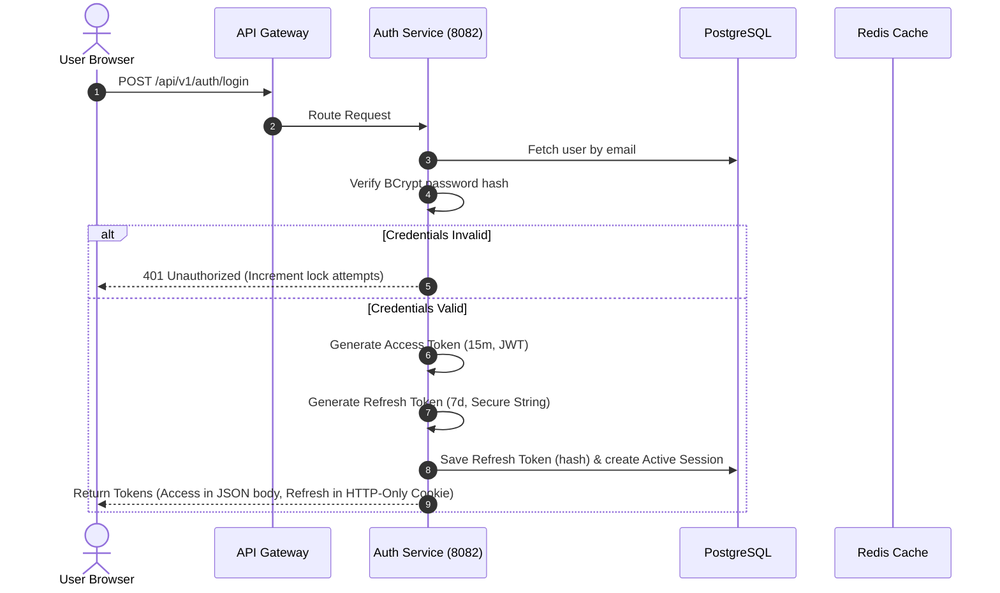
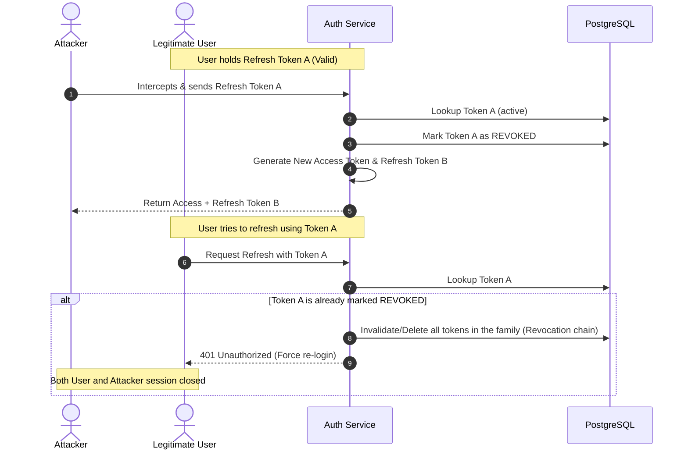
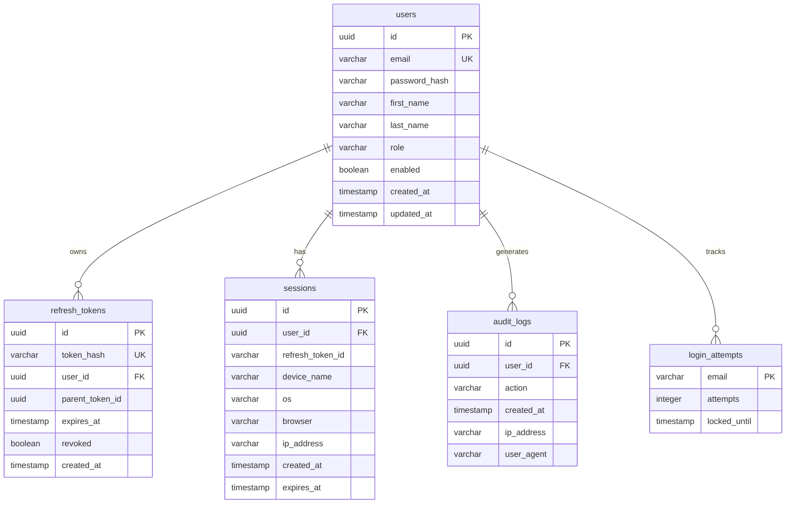

# Production-Grade Authentication Service Architecture

This document describes the production-level system architecture, database design, security control mechanisms, and implementation roadmap for the **Shortify Identity & Authentication Service**. 

---

## 1. Architectural Highlights & Security Trade-offs

To elevate this authentication service to production/FAANG grade, several key enhancements over traditional tutorials are implemented:

### Token Storage Strategy: Authorization Header vs. HTTP-Only Cookies
* **Decision**: We recommend using **Secure, HTTP-Only, SameSite=Strict cookies** for storing the Refresh Token, and **Authorization: Bearer headers** (or a secure local storage state) for the short-lived Access Token.
* **Justification**: Storing the long-lived refresh token in an HTTP-only cookie isolates it from cross-site scripting (XSS) attacks. SameSite protection shields the client against Cross-Site Request Forgery (CSRF).

### Token Revocation Strategy
* **Problem**: JSON Web Tokens (JWTs) are stateless, making immediate revocation difficult prior to their natural expiration.
* **Solution**: 
  1. Access tokens are kept extremely short-lived (15 minutes).
  2. If an access token must be revoked immediately (e.g., on logout or session termination), its signature/jti (JWT ID) is blacklisted in **Redis** with a Time-To-Live (TTL) equal to the remaining expiration duration of the token.
  3. Refresh tokens are stateful and stored in PostgreSQL, allowing instant revocation.

### ID Generation Strategy
* **Decision**: Use **UUIDs** (UUIDv4 or UUIDv7) or **Snowflake IDs** instead of auto-incrementing sequential integers (`BIGINT`) for primary keys.
* **Justification**: Prevents ID enumeration attacks (where malicious actors guess user ids by iterating `id+1`) and facilitates database sharding or replication.

---

## 2. System Flows & Lifecycle Diagrams

### Login and Token Exchange Flow


### Refresh Token Rotation (RTR) & Replay Prevention Flow
Refresh token rotation guarantees that a refresh token can only be used once. If a leaked refresh token is reused, the entire token family is immediately invalidated.



---

## 3. Database Schema Design (PostgreSQL)



### Table Specifications & Indexing Guidelines

```sql
-- Create extension for UUID generation if using PostgreSQL native generation
CREATE EXTENSION IF NOT EXISTS "uuid-ossp";

-- Table: users
CREATE TABLE users (
    id UUID PRIMARY KEY DEFAULT uuid_generate_v4(),
    email VARCHAR(255) NOT NULL UNIQUE,
    password_hash VARCHAR(255) NOT NULL,
    first_name VARCHAR(100),
    last_name VARCHAR(100),
    role VARCHAR(50) NOT NULL DEFAULT 'ROLE_USER',
    enabled BOOLEAN NOT NULL DEFAULT FALSE,
    created_at TIMESTAMP WITH TIME ZONE NOT NULL DEFAULT CURRENT_TIMESTAMP,
    updated_at TIMESTAMP WITH TIME ZONE NOT NULL DEFAULT CURRENT_TIMESTAMP
);
CREATE UNIQUE INDEX idx_users_email ON users(email);

-- Table: refresh_tokens
CREATE TABLE refresh_tokens (
    id UUID PRIMARY KEY DEFAULT uuid_generate_v4(),
    token_hash VARCHAR(255) NOT NULL UNIQUE,
    user_id UUID NOT NULL REFERENCES users(id) ON DELETE CASCADE,
    parent_token_id UUID,
    expires_at TIMESTAMP WITH TIME ZONE NOT NULL,
    revoked BOOLEAN NOT NULL DEFAULT FALSE,
    created_at TIMESTAMP WITH TIME ZONE NOT NULL DEFAULT CURRENT_TIMESTAMP
);
CREATE INDEX idx_refresh_tokens_hash ON refresh_tokens(token_hash);
CREATE INDEX idx_refresh_tokens_user ON refresh_tokens(user_id);

-- Table: sessions
CREATE TABLE sessions (
    id UUID PRIMARY KEY DEFAULT uuid_generate_v4(),
    user_id UUID NOT NULL REFERENCES users(id) ON DELETE CASCADE,
    refresh_token_id UUID REFERENCES refresh_tokens(id) ON DELETE SET NULL,
    device_name VARCHAR(255),
    os VARCHAR(100),
    browser VARCHAR(100),
    ip_address VARCHAR(45), -- Supports IPv6 lengths
    created_at TIMESTAMP WITH TIME ZONE NOT NULL DEFAULT CURRENT_TIMESTAMP,
    expires_at TIMESTAMP WITH TIME ZONE NOT NULL
);
CREATE INDEX idx_sessions_user ON sessions(user_id);

-- Table: login_attempts
CREATE TABLE login_attempts (
    email VARCHAR(255) PRIMARY KEY,
    attempts INT NOT NULL DEFAULT 0,
    locked_until TIMESTAMP WITH TIME ZONE
);

-- Table: audit_logs
CREATE TABLE audit_logs (
    id UUID PRIMARY KEY DEFAULT uuid_generate_v4(),
    user_id UUID REFERENCES users(id) ON DELETE SET NULL,
    action VARCHAR(100) NOT NULL,
    created_at TIMESTAMP WITH TIME ZONE NOT NULL DEFAULT CURRENT_TIMESTAMP,
    ip_address VARCHAR(45),
    user_agent VARCHAR(512)
);
CREATE INDEX idx_audit_logs_user ON audit_logs(user_id);
CREATE INDEX idx_audit_logs_created ON audit_logs(created_at);
```

---

## 4. API Endpoints Contract

All endpoints follow RESTful standards and return consistent JSON structures.

### Authentication Namespace (`/api/v1/auth/*`)

| Method | Endpoint | Access | Description |
| :--- | :--- | :--- | :--- |
| `POST` | `/api/v1/auth/register` | Public | Registers a user, fires email verification event. |
| `POST` | `/api/v1/auth/login` | Public | Verifies credentials, returns Access Token (JSON) and Refresh Token (Cookie). |
| `POST` | `/api/v1/auth/refresh` | Public | Performs Refresh Token Rotation. Requires Refresh Token Cookie. |
| `POST` | `/api/v1/auth/logout` | Public/Auth | Revokes the current active session and blacklists the access token in Redis. |
| `POST` | `/api/v1/auth/forgot-password` | Public | Generates a secure, temporary password-reset token & emails it. |
| `POST` | `/api/v1/auth/reset-password` | Public | Consumes the reset token and updates the user's password. |
| `POST` | `/api/v1/auth/verify-email` | Public | Validates verification code to set user status `enabled = true`. |

### Users Management Namespace (`/api/v1/users/*`)

| Method | Endpoint | Access | Description |
| :--- | :--- | :--- | :--- |
| `GET` | `/api/v1/users/me` | Authenticated | Retrieves current logged-in user profile attributes. |
| `GET` | `/api/v1/users/sessions` | Authenticated | Lists all active device sessions for the authenticated user. |
| `DELETE` | `/api/v1/users/sessions/{id}` | Authenticated | Revokes a specific active session (force logouts device). |

---

## 5. Directory & Package Layout

```text
src/main/java/com/prakhar/authservice
├── config/
│   ├── SecurityConfig.java       # Spring Security filters, CORS/CSRF
│   ├── RedisConfig.java          # Caching & JWT blacklisting pool
│   └── AppConfig.java            # Password encoder, general beans
├── controller/
│   ├── AuthController.java       # Auth routes (login, register, refresh)
│   └── UserController.java       # User profile and session management
├── dto/
│   ├── request/                  # LoginRequest, RegisterRequest, ResetRequest
│   └── response/                 # AuthResponse, UserProfileResponse, SessionResponse
├── entity/
│   ├── User.java                 # JPA Entity for users table
│   ├── RefreshToken.java         # JPA Entity for refresh_tokens
│   ├── Session.java              # JPA Entity for sessions
│   ├── LoginAttempt.java         # JPA Entity for login locking
│   └── AuditLog.java             # JPA Entity for audit logging
├── exception/
│   ├── GlobalExceptionHandler.java # Map exceptions to API Error DTOs
│   ├── LockedException.java
│   └── TokenInvalidException.java
├── repository/
│   ├── UserRepository.java
│   ├── RefreshTokenRepository.java
│   ├── SessionRepository.java
│   ├── LoginAttemptRepository.java
│   └── AuditLogRepository.java
├── security/
│   ├── JwtTokenProvider.java     # Generate, validate, and parse JWTs
│   ├── JwtAuthenticationFilter.java # Pre-auth filter for extracting Bearer tokens
│   └── UserDetailsServiceImpl.java  # Load users from database for Spring Security
├── service/
│   ├── AuthService.java          # Login, Register, Logout orchestration
│   ├── TokenService.java         # Rotation, family check, database management
│   ├── SessionService.java       # Session listing, device details parsing
│   ├── AuditLogService.java      # Create logging records asynchronously
│   └── EmailService.java         # HTML email dispatcher
└── util/
    ├── DeviceParser.java         # Parse User-Agent using UAP-detector
    └── SecurityUtils.java        # Helpers for fetching authenticated credentials
```

---

## 6. Project Setup & Maven Dependencies (`pom.xml` configuration)

Include the following dependencies in your Spring Boot project configurations:

```xml
<dependencies>
    <!-- Core Spring Boot Starters -->
    <dependency>
        <groupId>org.springframework.boot</groupId>
        <artifactId>spring-boot-starter-web</artifactId>
    </dependency>
    <dependency>
        <groupId>org.springframework.boot</groupId>
        <artifactId>spring-boot-starter-security</artifactId>
    </dependency>
    <dependency>
        <groupId>org.springframework.boot</groupId>
        <artifactId>spring-boot-starter-data-jpa</artifactId>
    </dependency>
    <dependency>
        <groupId>org.springframework.boot</groupId>
        <artifactId>spring-boot-starter-validation</artifactId>
    </dependency>
    <dependency>
        <groupId>org.springframework.boot</groupId>
        <artifactId>spring-boot-starter-data-redis</artifactId>
    </dependency>

    <!-- PostgreSQL Driver & Flyway Database Migration -->
    <dependency>
        <groupId>org.postgresql</groupId>
        <artifactId>postgresql</artifactId>
        <scope>runtime</scope>
    </dependency>
    <dependency>
        <groupId>org.flywaydb</groupId>
        <artifactId>flyway-core</artifactId>
    </dependency>

    <!-- Lombok Boilerplate Reduction -->
    <dependency>
        <groupId>org.projectlombok</groupId>
        <artifactId>lombok</artifactId>
        <optional>true</optional>
    </dependency>

    <!-- JSON Web Token (jjwt) -->
    <dependency>
        <groupId>io.jsonwebtoken</groupId>
        <artifactId>jjwt-api</artifactId>
        <version>0.12.5</version>
    </dependency>
    <dependency>
        <groupId>io.jsonwebtoken</groupId>
        <artifactId>jjwt-impl</artifactId>
        <version>0.12.5</version>
        <scope>runtime</scope>
    </dependency>
    <dependency>
        <groupId>io.jsonwebtoken</groupId>
        <artifactId>jjwt-jackson</artifactId>
        <version>0.12.5</version>
        <scope>runtime</scope>
    </dependency>

    <!-- User-Agent Parsing Utility -->
    <dependency>
        <groupId>nl.basjes.parse.useragent</groupId>
        <artifactId>yauaa</artifactId>
        <version>7.23.0</version>
    </dependency>
</dependencies>
```

---

## 7. Advanced Production Safeguards

### A. Rate Limiting at Gateway level
Protect endpoints `/api/v1/auth/login` and `/api/v1/auth/register` using Redis Rate Limiter in Spring Cloud Gateway to prevent brute force and denial of service attacks (e.g. limit to 5 login attempts per minute per IP address).

### B. Password Encoders
Use Spring Security’s `BCryptPasswordEncoder` configured with a strength rating of `12` (work factor) to secure passwords.

### C. Async Auditing
Audit logs should be created asynchronously (e.g. annotated with `@Async` or published via Spring Event publisher) to ensure audit logging overhead does not block request/response performance cycles of main auth routes.

### D. CORS and CSRF Setup
* **CORS**: Explicitly configure CORS configurations with allowed origins (never allow wildcards `*` for authenticated routes using credentials).
* **CSRF**: If storing Refresh Token in Cookie, ensure CSRF token configurations (like Spring Security's `CookieCsrfTokenRepository`) are activated or protect state-modifying requests securely.
