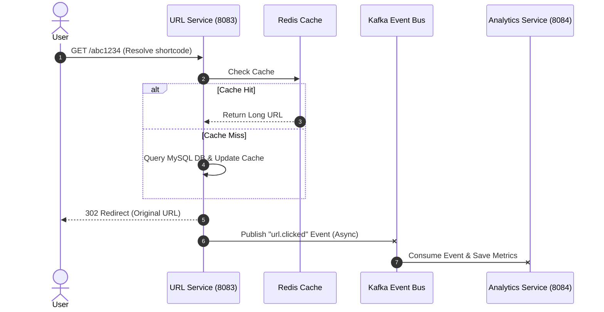

# Microservices Architecture — Shortify

This document describes the high-level architecture, service interactions, and data model designs for **Shortify**, our distributed URL shortener system.

---

## Service Overview

| Service | Port | Responsibility | Primary Datastore |
| :--- | :--- | :--- | :--- |
| **Auth Service** | `8082` | User registrations, security validation, password resets, and token management | MySQL (`auth_db`) |
| **URL Service** | `8083` | URL shortening, redirects (hot path), custom aliases, and QR codes | MySQL (`url_db`) + Redis (LRU cache) |
| **Analytics Service** | `8084` | Captures clicks asynchronously and builds country, device, and browser reports | MySQL (`analytics_db`) |
| **Notification Service** | `8085` | Listens for events to send email alerts | None (State-free Kafka consumer) |
| **Payment Service** | `8086` | Razorpay order checkout, billing period verification, and plan subscriptions | MySQL (`payment_db`) |

> [!IMPORTANT]
> **Database Isolation**: In compliance with microservices architecture guidelines, each service owns its datastore schema. No direct cross-database joins are allowed. Any inter-service data integration is orchestrated via REST endpoints or asynchronously using Kafka events.

---

## Communication Patterns

### Asynchronous Event Streaming (Kafka)
- **High-Performance Redirects**: The redirect path (`GET /:shortCode`) is optimized for low latency. To avoid slowing down redirects with synchronous database writes, the **URL Service** resolves the link and immediately publishes a `url.clicked` event to Kafka.
- **Independent Consumers**: The **Analytics Service** and **Notification Service** listen to the event bus in parallel to process and persist metrics.



### Synchronous Communication (REST)
- **Frontend Interceptor**: The React frontend sends requests to services. The JWT access tokens are validated statelessly by a custom security filter on downstream services (`url-service`, `payment-service`) decoding the signature with the shared `JWT_SECRET`.
- **Payment Verification Flow**:
  1. Frontend hits `/api/v1/payments/create-order` on the **Payment Service** to request a new Razorpay order.
  2. The payment service talks to Razorpay's API and returns the transaction metadata.
  3. Frontend opens the Razorpay checkout dialog.
  4. On successful checkout, frontend posts verification details to `/api/v1/payments/verify`.
  5. The payment service cryptographically verifies the signature, activates the subscription in `payment_db`, and broadcasts a `payment.success` event to Kafka.

---

## Project Repository Layout

```text
url-shortener/
├── backend/
│   └── services/
│       ├── auth-service/           # User Auth, session management (Port 8082)
│       ├── url-service/            # URL redirects, Base62 hashing (Port 8083)
│       ├── analytics-service/      # Tracks clicks consumed via Kafka (Port 8084)
│       ├── notification-service/   # Event-driven mail notifications (Port 8085)
│       └── payment-service/        # Billing & Razorpay gateway (Port 8086)
├── frontend/                       # React 18 dashboard & billing portal (Port 3000)
├── infrastructure/
│   ├── docker/
│   │   ├── mysql/                  # Database schema init SQL scripts
│   │   └── monitoring/             # Prometheus & Grafana configs
│   └── monitoring/
└── docker-compose.yml              # Combined local runtime orchestrator
```
