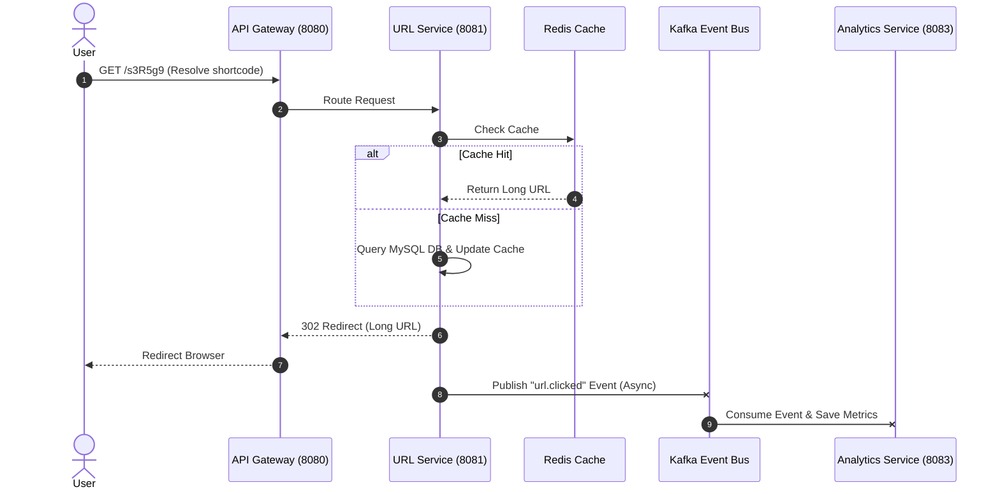

# Microservices Architecture - Shortify

This document describes the high-level architecture and communication patterns for **Shortify**, our distributed URL shortener system.

---

## Service Overview

| Service | Port | Responsibility | Database / Storage |
|---|---|---|---|
| **API Gateway** | `8080` | Single entry point, routing, rate limiting, authentication filter | None |
| **URL Service** | `8081` | Shortens URLs, resolves short codes to long URLs, manages link expiry | MySQL + Redis (caching) |
| **Auth Service** | `8082` | User registration, login, JWT issuance and validation | MySQL |
| **Analytics Service** | `8083` | Tracks link clicks, device, geography, and referrer statistics | MySQL |
| **Notification Service** | `8084` | Sends email alerts (e.g., link expiration, reports) | None |

> [!IMPORTANT]
> **Database Isolation**: Each service is completely independent with its own schema and deployed in its own Docker container. Services never share a database directly to ensure loose coupling and independent scalability.

---

## Communication Patterns

### Synchronous Communication (HTTP / gRPC)
- **API Gateway → Services**: Gateway routes incoming client traffic to internal microservices.
- **Service → Service (Feign Client)**: Used when immediate responses are required.
  - *Example*: The URL Service or Gateway calling the Auth Service to validate a JWT token before processing a request.

### Asynchronous Communication (Kafka Event Bus)
- **Publish-Subscribe**: Used for non-blocking operations and background processing.
  - *Example*: When a short link is resolved, the URL Service publishes a `url.clicked` event to a Apache Kafka topic.
  - Both the **Analytics Service** and **Notification Service** consume this event independently to update statistics and trigger alerts without blocking the client redirect response.



---

## Project Layout

The repository is organized as a monorepo containing all microservices, common infrastructure configurations, and the web frontend.

```text
url-shortener/
├── api-gateway/          # Spring Cloud Gateway
├── eureka-server/        # Netflix Eureka Service Discovery
├── config-server/        # Centralized configurations (Git/Local application.yml)
├── url-service/          # Spring Boot URL Service (Core Shortener + Redis)
│   └── src/ + Dockerfile
├── auth-service/         # Spring Boot Auth Service (JWT issuance)
│   └── src/ + Dockerfile
├── analytics-service/    # Spring Boot Analytics Service (Kafka Consumer)
│   └── src/ + Dockerfile
├── notification-service/ # Spring Boot Notification Service (Kafka Consumer)
│   └── src/ + Dockerfile
├── frontend/             # React (Vite, Tailwind, i18n) application
├── docker-compose.yml    # Full local orchestration stack
└── k8s/                  # Kubernetes manifests (Optional)
```

---

## Tech Stack & Dependencies

All backend microservices are built using **Spring Boot 3.x** and **Spring Cloud**.

### Common Backend Dependencies
- **Spring Web**: RESTful API design.
- **Spring Data JPA**: Database ORM (Hibernate).
- **Netflix Eureka Client**: Service registration with Discovery Server.
- **Spring Cloud Config Client**: Remote configuration fetching.
- **Micrometer Tracing + OpenTelemetry**: Distributed tracing integrated with Zipkin.

### Service-Specific Dependencies (Maven `pom.xml` additions)
* **API Gateway**:
  - `spring-cloud-starter-gateway`
  - `spring-cloud-starter-netflix-eureka-server` (if co-hosted, or gateway client registration)
* **URL Service & Analytics Service**:
  - `spring-kafka` (Kafka producer and consumer support)
* **URL Service (Caching)**:
  - `spring-boot-starter-data-redis`
* **Auth Service**:
  - `spring-boot-starter-security`
  - `jjwt-api` / `jjwt-impl` / `jjwt-jackson` (JSON Web Token generation)

---

## Recommended Step-by-Step Build Order

1. **Infrastructure First**: Setup the Eureka Discovery Server and the Config Server.
2. **Auth Service**: Implement registration, login, and JWT token issuing.
3. **URL Service**: Implement core shortening algorithm, MySQL persistence, and Redis caching.
4. **API Gateway**: Configure routing rules, Eureka integration, and configure the custom JWT validation filter.
5. **Analytics Service**: Create the database schema and implement the Kafka consumer for the `url.clicked` event.
6. **Notification Service**: Configure email templates and consume Kafka events for alert thresholds.
7. **React Frontend**: Connect user interfaces directly to the API Gateway port (`8080`).
8. **Docker Compose**: Wire up containerized databases, Redis, Kafka, Eureka, Config, services, and frontend in a single local stack.
